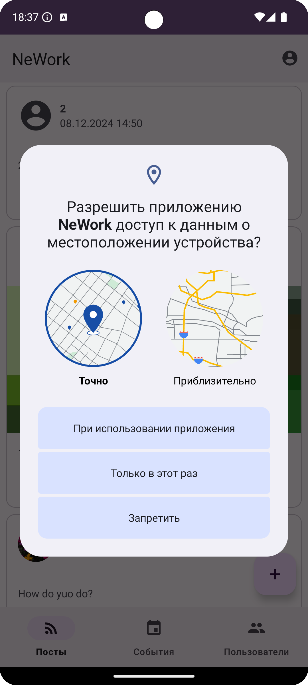
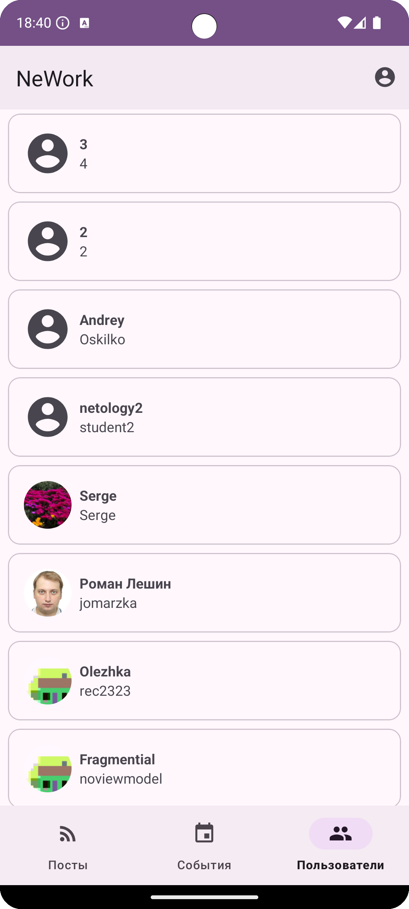

# NeWork

## Дипломный проект по профессии «Android Developer»

Приложение представляет собой социальную сеть, которая позволяет пользователям создавать посты и события, а также указывать свои места работы.

В зависимости от системных настроек телефона, в приложении реализованы:
| Функция | Описание |
|---------|-----------|
| Оформление темы | Светлая, тёмная|
| Язык | Английский, Русский |

## Технологии и инструменты

* Android Studio
* Kotlin
* MVVM архитектура
* Kotlin Coroutines
* Material3
* Retrofit
* Dagger Hilt
* Room
* Navigation Component
* ViewBinding
* Yandex MapKit
* Swagger
* Figma
* Git + GitHub

## Основные возможности

**Аутентификация**
- Регистрация нового пользователя
- Вход в существующий аккаунт
- Выход из аккаунта

**Посты**
- Просмотр ленты постов
- Создание новых постов
- Редактирование своих постов
- Удаление своих постов
- Поддержка медиа-вложений (фото, видео, аудио)
- Отметка пользователей в постах
- Геолокация

**События**
- Просмотр списка событий
- Создание новых событий
- Редактирование своих событий
- Удаление своих событий
- Поддержка медиа-вложений
- Указание даты и времени проведения
- Выбор типа события (онлайн/офлайн)
- Добавление спикеров
- Геолокация

**Профиль**
- Просмотр профилей пользователей
- Редактирование своего профиля
- Управление местами работы
- Просмотр стены постов пользователя

## Интерфейс приложения

**Начало работы**

   

**Профиль пользователя**

  

**Основные экраны**

  
  

